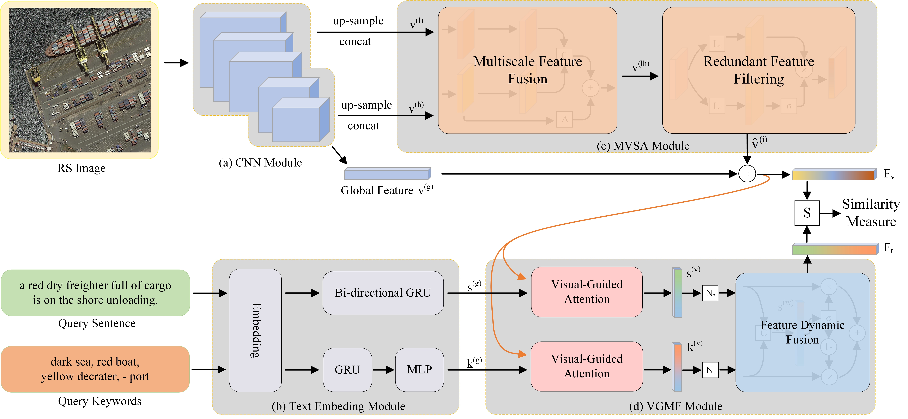

## The offical PyTorch code for paper ["Exploring a Fine-grained Multiscale Method for Cross-modal Remote Sensing Image Retrieval", TGRS 2021.](https://ieeexplore.ieee.org/document/9437331)

##### Author: Zhiqiang Yuan 

<a href="https://github.com/xiaoyuan1996/retrievalSystem"></a>


<a href="https://pypi.org/project/mitype/"></a>


### -------------------------------------------------------------------------------------
### Welcome :+1:_<big>`Fork and Star`</big>_:+1:, then we'll let you know when we update

```bash
#### News:
#### 2021.05.22: ---->RSITMD is expected to be released before July<----
#### 2021.06.21: ---->RSITMD is now open to access<----
#### 2021.07.29: ---->The code of AMFMN is expected to be released before September<----
#### 2021.08.03: ---->The code of AMFMN has been open to access<----
#### 2021.10.28: ---->Four samples were updated to correct blank sentences<----
```
### -------------------------------------------------------------------------------------

## INTRODUCTION
This is AMFMN, a cross-modal retrieval method for remote sensing images.
Here, you can get the benchmark of the image-text cross-modal retrieval method, which can be further modified to obtain higher retrieval accuracy. 
Next, we will publish the more fine-grained image-text RSITMD dataset, and welcome you to use the proposed dataset.

##
## [AMFMN](AMFMN/README.md)
### Network Architecture

Asymmetric multimodal feature matching network for RS image-text retrieval. AMFMN uses the MVSA module to obtain salient image features and uses salient features to guide the representation of text modalities. The network supports multiple retrieval methods and can adaptively fuse different modal text information.

##

Multiscale Visual Self-Attention. We first use a multiscale feature fusion network to obtain the multilevel feature representation, then use a redundant feature filtering network to filter out useless feature expressions, and finally get the salient mask of the RS image.

##

Three different visual-guided attention mechanisms.

##
## [RSITMD](RSITMD/README.md)
### Dataset Features

The similarity visualization results of six datasets, where the similarity score is weighted by the BLEU and METEOR indicators in the natural
language processing field. The ideal picture is a straight diagonal line from the upper left to the lower right, which means each sentence is only related to the
corresponding image.

##

Quantitative comparison of the four datasets. (a) Comparison of sample number. (b) Comparison of average sentence length. (c) Comparison of
diversity score. (d) Comparison of average similarity. (e) Comparison of the total number of words. (f) Comparison of the number of categories.

## Citation
If you feel this code helpful or use this code or dataset, please cite it as
```
Z. Yuan et al., "Exploring a Fine-Grained Multiscale Method for Cross-Modal Remote Sensing Image Retrieval," in IEEE Transactions on Geoscience and Remote Sensing, doi: 10.1109/TGRS.2021.3078451.
```
